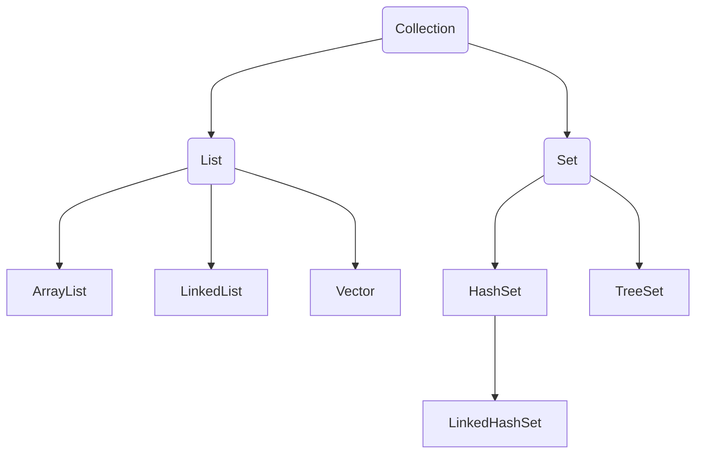

# 常用API

## Scanner

- 导包
  - Scanner sc = new Scanner(System.in)
- 创建对象
  - int i = sc.nextInt()
- 接收数据
  - System.out.println(i)

```java
import java.util.Scanner;

public class ScannerDemo1 {
  public static void main(String[] args) {
    Scanner sc = new Scanner(System.in);
    System.out.println("Please input");
    int i = sc.nextInt();
    System.out.println(i);
  }
}
```

## switch

- 简化写法

```java
public class ScannerDemo1 {
  public static void main(String[] args) {
    switch (number) {
      case 1 -> System.out.println('1');
      case 2 -> System.out.println('2');
      case 3 -> System.out.println('3');
      case 4 -> System.out.println('4');
      default -> System.out.println('0');
    }
  }
}
```

## Math

- abs(int a)
- ceil(double a)
- floor(double a)
- round(float a)
- max(int a, int b)
- pow(double a, double b)
- random()

## system

- public static void exit(int status)  终止当前运行的java虚拟机
- public static long currentTimeMillis()  返回当前系统的时间毫秒值形式
- public static void arraycopy(originArray, startIndex, targetArray, startIndex, amount)

## Runtime

- public static Rumtime getRuntime()  表示当前虚拟机的运行环境
- public void exit(int status)  
- public int availableProcessors()   
- public long maxMemory()
- public long totalMemory()
- public long freeMemory()
- public Process exec(String commond)

## Object

- public static String toString(): 一般会重写，打印对象时打印属性
- public boolean equals(Object obj)：比较对象时会重写，比较对象属性值是否相同
- public Object clone()：默认浅克隆，重写为深克隆

## BigInteger

### 创建BigInteger 对象

- BigInteger bd = new BigInteger()

- BigInteger.valueOf()
- add()
- divideAndRemainder()
- equels()
- pow()
- max()
- intValue()
- doubleValue()

## BigDecimal

- BigDecimal bd = new BigDecimal()

- public BigDecimal add(BigDecimal val)
- public BigDecimal subtract(BigDecimal val)
- public BigDecimal multiply(BigDecimal val)
- public BigDecimal divide(BigDecimal val)
- public BigDecimal divide(BigDecimal val, 精确几位，舍入)

## Date

### SimpleDateFormat 的两个作用

- 格式化
- 解析

### 如何指定格式

- yyyy年MM月dd日 HH：mm：ss

## Calendar

- Calendar 代表了系统当前时间的日历对象，可以单独修改、获取时间中的年、月、日
- 细节：Calendar 是一个抽象类，不能直接创建对象

### 获取 Calendar 日历对象的方法

- public static Calendar gerInstance() 获取当前时间的日历对象

### 常用方法

- public final Date getTime()  获取日期对象
- public final setTime(Date date)  给日历设置日期对象
- public long getTimeInMillis() 拿到时间毫秒值
- public void setTimeinMillis(long millis)  给日历设置时间毫秒值
- public int get(int field)   取日历中的某个字段信息
- public void set(int field, int value)   修改日历的某个字段信息
- public void add(int field, int amount)  为某个字段增加/减少指定的值

## JDK8 时间

### Date 类

- ZoneId：时区
- Instant：时间戳
- zoneDateTime：带时区的时间

### 日期格式化类 SimpleDateFormat

- DateTimeFormatter 用于时间的格式化和解析

### 日历类 Calendar

- LocalDate：年、月、日
- LocalTime：时、分、秒
- LocalDateTime：年、月、日、时、分、秒

### 工具类

- Duration：时间间隔（秒、纳秒）
- Period：时间间隔（年、月、日）
- ChronoUnit：时间间隔（所有单位）

## 包装类

### 什么是包装类

- 基本数据类型对应的引用类型

### 包装类

- byte --- Byte
- short --- Short
- char --- Character
- int --- Interger
- long --- Long
- float --- Float
- double --- Double
- boolean --- Boolean

### 自动装箱

- 把基本数据类型自动变成包装类cha
- Integer i = 10

### 自动拆箱

- 把包装类自动变为基本类型
- int i = i2

### Integer API

- public static String toBinaryString(int i)  得到二进制
- public static String toOctalString(int i)   得到八进制
- puclic static String toHexString(int i)     得到十六进制
- public static int parseInt(String s)        将字符串类型的整数转为整数类型

## Arrays

- public static String toString()
- public static int binarySearch(array, element)
- public static int[] copyOf(original array, length)
- puclic static int[] copyOfRange()
- public static void fill()
- public static void sort()
- public static void sort()

## lambda 表达式

```java
public class LambdaDemo1 {
  public static void main(String[] args) {
    Integer[] arr = {1, 2, 3, 4, 5};
    // Arrays.sort(arr, new Comparator<Integer>() {
    //   public int compare(Integer o1, Integer o2) {
    //     return o1 - o2;
    //   }
    // })

    Arrays.sort(arr, (Integer o1, Integer o2) -> {
      return o1 - o2;
    });
  }
}
```

### Lambda 表达式的基本作用

- 简化函数式接口的匿名内部类的写法

### Lambda 表达式有什么使用前提

- 必须是接口的匿名内部类，接口中只能有一个抽象方法

### Lambda 的好处

- Lambda 是一个匿名函数，我们可以把Lambda表达式理解为是一段可以传递的代码，他可以写出更简洁，更灵活的代码，作为一种更紧凑的代码风格，使Java语言表达能力得到了提升

### Lambda 表达式的省略规则

- 参数类型可以省略不写
- 如果只有一个参数，参数类型可以省略，同时（）也可以省略
- 如果Lambda表达式的方法体只有一行，大括号、分号return可以省略不写，需要同时省略

## 集合

### 单列集合 Collection



- 接口：Collection、List、Set
- 实现类：ArrayList、linkedList、Vector、HashSet、TreeSet、LinkedHashSet

### 迭代器遍历

- 细节注意点
  - 报错 NosuchElementException
  - 迭代器遍历完毕，指针不会复位
  - 循环中只能用一次next方法
  - 迭代器遍历时，不能用集合的方法进行增加或者删除，可以用迭代器提供的方法remove 进行删除，但无法添加

- 迭代器需要掌握的三个方法
  - `Iterator<String> it = list.iterator()`
  - `it.hasNext()`
  - `it.next()`

### 增强for遍历

- 增强for底层就是迭代器，为了简化迭代器的代码书写
- JDK5之后出现的，其内部原理就是一个Iterator迭代器
- 所有单列集合和数组才能使用增强for进行遍历

### List系列

- 添加的元素是有序、可重复、有索引
- Collection的方法List都继承了
- List集合因为有索引，所以多了很多索引操作的方法

```java
// 普通for
Iterator<String> it = list.iterator();
while (it.hasNext()) {
  String str = it.next();
  System.out.println(str);
}

// 增强for
for (String s : list) {
  System.out.ptintln(s);
}

// lambda
list.forEach(new Comsumer<string>() {
  public void accept(String s) {
    System.out.println(s);
  }
})

list.forEach(s -> System.out.println(s));

//for
for (int i = 0; i < list.size(); i++) {
  String s = list.get(i);
  System.out.println(s);
}

// 列表迭代器 ListIterator
listIterator<String> it = list.listIterator(); // 指针默认指向0索引
while(it.hasNext()) {
  String str = it.next();
  if ("bbb".equals(str)) {
    it.add("qqq");
  }
}

```

### 遍历方式总结

- 迭代器遍历：在遍历的过程中需要删除元素，使用迭代器
- 列表迭代器：在遍历的过程中需要添加元素，请使用列表迭代器
- 增强for & lambda：仅仅想遍历，那么使用增强for或者lambda
- 普通for：如果遍历的时候想操作索引，可以使用普通for

## ArrayList

